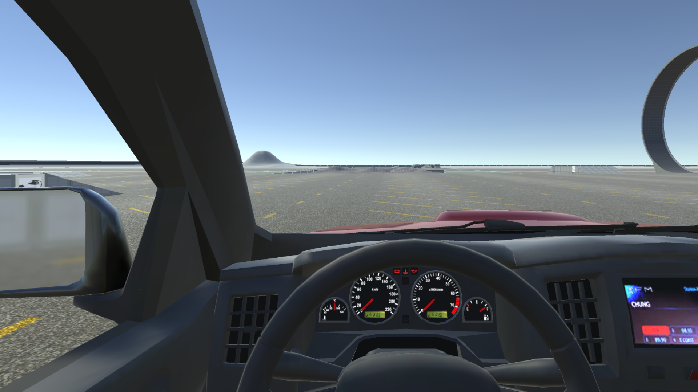
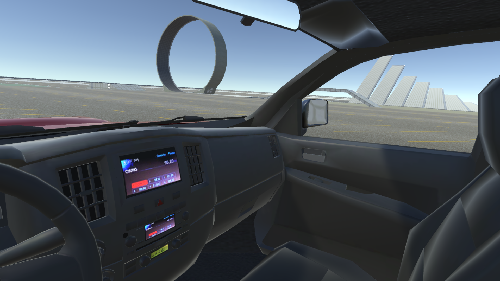
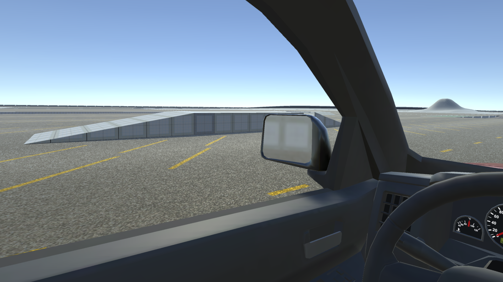
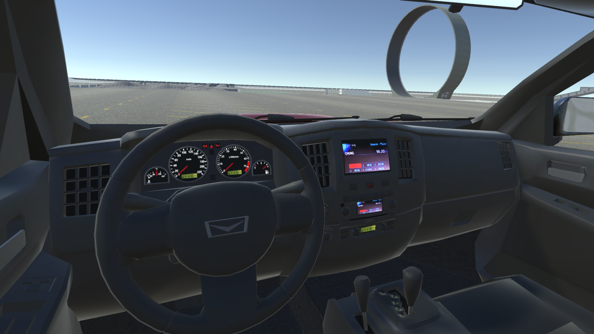
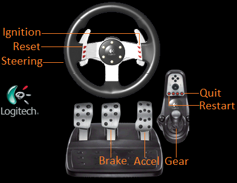
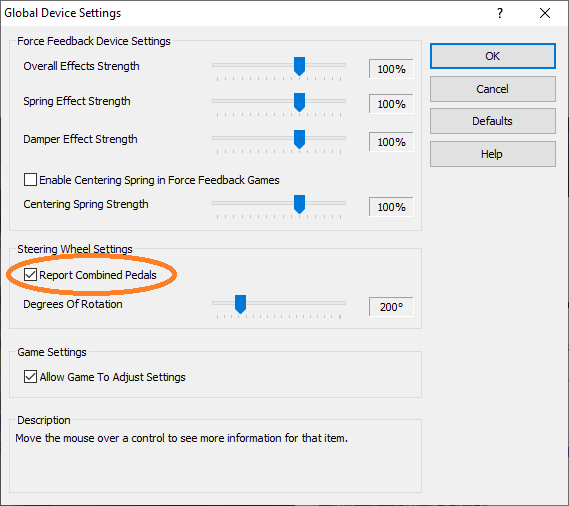
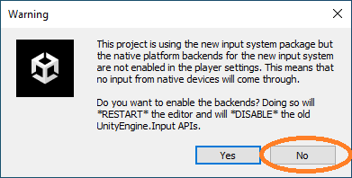

# VR Driving Sim

## See branch [v2.0](https://github.gatech.edu/SonificationLab/VR-Driving-Sim/tree/v2.0) for the latest version!

## Screenshots

## Requirements
* Unity 2021.2.19f1

## Setup

### Logitech G27 Steering Wheel setup

### Logitech Profiler setup

Enable `Report Combined Pedals` under the `Global Device Settings` section.

### Unity Engine setup

Select `No` when Unity Engine warns about the input system.

Open the scene at `Assets/Vehicle Physics Pro/Scenes/JPickup Demo.unity`

## Usage
1. Press the ignition button to start the vehicle
2. Drive the vehicle via the steering wheel and foot pedals
3. Press the reset button to re-position the vehicle if in an irrecoverable position
4. To reverse, switch to the reverse gear, then accelerate and steer as needed.
5. To switch out of reverse gear, simply switch to the first gear.
6. Press the restart button to restart the simulation from the beginning.
7. Press the quit button to finally quit the simulation.

## Vignette Controller
Parameters:
* Scale:		Angular velocity scaling factor applied to both pitch and yaw, range: 0 - 1
* Smooth Time:		Approximate time taken for steady intensity value (larger is slower), range: 0 - 1
* Max Intensity:	Proportional to minimum FOV (smaller value produces larger FOV), range: 0 - 1

## TODO
* Check if Assets, Packages, and ProjectSettings need to be checked-in

